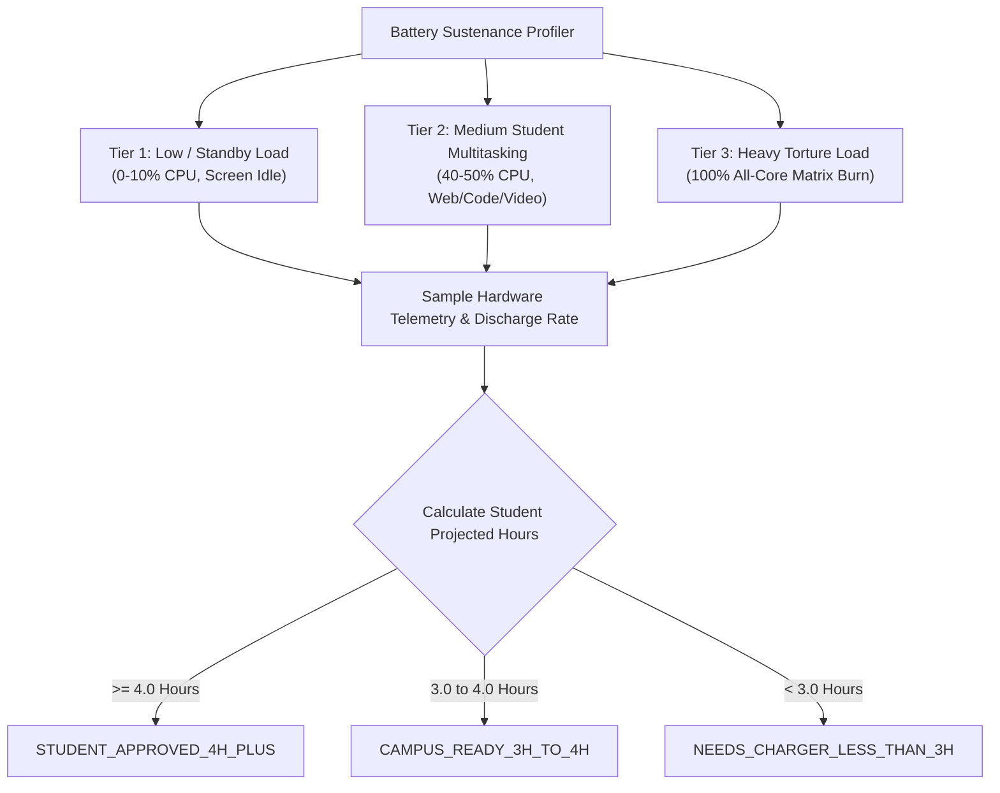

# BenchQC Hardware Stress-Testing & Battery Sustenance Suite

[](https://benchqc.com)
[](#)
[](#)

The **BenchQC Hardware Stress-Testing and Battery Sustenance Suite** is a high-performance, cross-platform hardware audit and quality-control diagnostic engine. It rigorously stresses system components (CPU, RAM, Storage, Thermals), captures deep low-level battery telemetry, executes multi-tier discharge profiling, and generates cryptographic, Storefront-ready audit artifacts (`benchqc_audit.json`).

---

## Key Capabilities

- **Primary Target**: Optimized for **Windows 10 / 11** with first-class support for **Linux** and **macOS**.
- **Student 3-4 Hour Workload Sustenance Benchmark**:
  - Multi-tier discharge profiling across **Low** (reading/standby), **Medium Student Load** (40-50% simulated multitasking with web browsing, IDE coding, and video lectures), and **Heavy** (100% torture).
  - Real-time hardware telemetry: Voltage (mV), Discharge Rate (mW), Wear %, Cycle Count, Design Capacity (mWh), and Full Charge Capacity (mWh).
  - Automated Student Badge assignment:
    - `STUDENT_APPROVED_4H_PLUS` (>= 4.0 Hours)
    - `CAMPUS_READY_3H_TO_4H` (3.0 - 4.0 Hours)
    - `NEEDS_CHARGER_LESS_THAN_3H` (< 3.0 Hours)
- **Hardware Torture & QC**:
  - **CPU**: Multi-core matrix burn, floating-point trigonometry/exponential stress, and arithmetic parity checking.
  - **Memory**: RAM saturation with alternating bit patterns (`0x55`, `0xAA`), walking bit tests, and MD5 block hash parity checks.
  - **Storage**: High-throughput sequential write/read integrity and random 4KB IOPS stress testing.
  - **Thermals**: Baseline vs. peak temperature monitoring, delta temperature tracking, and CPU clock degradation throttling detection.
- **Storefront Ready**: Generates verified `benchqc_audit.json` ready for one-click import into the BenchQC Storefront.

---

## One-Click Launchers

### Windows
Double-click or run from PowerShell / Command Prompt:
```cmd
run_windows.bat
```
Or with PowerShell:
```powershell
.\run_windows.ps1
# For quick audit mode:
.\run_windows.ps1 -Quick
```

### Linux
```bash
./run_linux.sh
# Or quick mode:
./run_linux.sh --quick
```

### macOS
```bash
./run_mac.sh
# Or quick mode:
./run_mac.sh --quick
```

---

## CLI Usage

```bash
# Run full standard hardware audit & battery sustenance profiling
python -m benchqc

# Run quick intake verification audit (5-10s)
python -m benchqc --quick

# Specify custom output path
python -m benchqc -o output_audit.json

# Suppress ASCII banner or terminal report
python -m benchqc --no-banner --no-report
```

---

## Battery Sustenance Profiling Methodology

The BenchQC Battery Sustenance Profiler evaluates real-world laptop endurance through a 3-tier duty-cycled workload:



### Sustenance Formulas
$$\text{Health } \% = \min\left(100, \frac{\text{FullChargeCapacity (mWh)}}{\text{DesignCapacity (mWh)}} \times 100\right)$$
$$\text{Wear } \% = \max\left(0, 100 - \text{Health } \%\right)$$
$$\text{Projected Student Hours} = \frac{\text{FullChargeCapacity (mWh)}}{\text{StudentAverageDischargeRate (mW)}}$$

---

## Certified Grade System

| Score Range | Certified Grade | Description |
| :--- | :---: | :--- |
| **93.0 - 100.0** | **`A+`** | **Platinum Certified**: Flawless hardware, zero errors, superior battery & thermals. |
| **84.0 - 92.9** | **`A`** | **Certified Excellent**: Exceeds campus standards, high health, dependable cooling. |
| **70.0 - 83.9** | **`B`** | **Certified Good**: Solid daily student driver, minor wear acceptable. |
| **55.0 - 69.9** | **`C`** | **Conditional Pass**: Noticeable battery wear or thermal throttling under heavy load. |
| **< 55.0** | **`F`** | **Rejected / Failed**: Hardware errors, severe bit flips, or critical overheating. |

---

## Storefront JSON Schema (`benchqc_audit.json`)

```json
{
  "auditId": "BQC-20261003-7C9D3B34",
  "auditDate": "2026-10-03T08:25:31.789327+00:00",
  "certifiedGrade": "A+",
  "overallScore": 97.0,
  "system": {
    "os": "Ubuntu 26.04.1 LTS",
    "osVersion": "7.0.0-34-generic",
    "cpu": "Intel(R) Core(TM) i5-8265U CPU @ 1.60GHz",
    "cpuCores": 4,
    "cpuThreads": 8,
    "ramGb": 31.2,
    "storageGb": 936.8,
    "model": "S6445 MD61489",
    "manufacturer": "MEDION",
    "architecture": "x86_64",
    "biosVersion": "212"
  },
  "battery": {
    "healthPercent": 88.2,
    "wearPercent": 11.8,
    "cycleCount": 136,
    "designCapacityMwh": 41610.0,
    "fullCapacityMwh": 36685.0,
    "currentCapacityMwh": 36240.0,
    "currentVoltageMv": 12821.0,
    "dischargeRateMw": 11800.0,
    "projectedHoursStudent": 3.11,
    "projectedHoursHeavy": 1.38,
    "projectedHoursIdle": 6.33,
    "studentBadge": "CAMPUS_READY_3H_TO_4H",
    "isSimulatedOrAC": false,
    "powerState": "Not charging",
    "modelName": "M153137"
  },
  "thermals": {
    "baselineTempC": 50.0,
    "peakTempC": 51.4,
    "deltaTempC": 1.4,
    "throttleDetected": false,
    "throttlingPercent": 0.0,
    "frequencyBaselineGhz": 1.2,
    "frequencyUnderStressGhz": 1.2
  },
  "qcSummary": {
    "cpuStatus": "PASSED",
    "memoryStatus": "PASSED",
    "storageStatus": "PASSED",
    "batteryStatus": "PASSED",
    "thermalStatus": "PASSED",
    "overallStatus": "CERTIFIED",
    "passedChecksCount": 5,
    "totalChecksCount": 5,
    "notes": []
  },
  "studentSuitability": {
    "recommendation": "Campus-ready for standard 3-hour lecture blocks and medium study sessions.",
    "expectedClassroomBatteryLife": "3.1 Hours (Campus Ready)",
    "badge": "CAMPUS_READY_3H_TO_4H",
    "workloadReadiness": {
      "webBrowsingAndResearch": "GOOD (3.5 - 4 hrs)",
      "videoLecturesAndZoom": "GOOD (3 - 3.5 hrs)",
      "codingAndIDEs": "GOOD (3 - 3.5 hrs)",
      "multitaskingAndDocs": "GOOD (3.5 hrs)"
    }
  },
  "benchmarks": {
    "cpuFloatingPointOpsSec": 2731350438.6,
    "cpuMultiCoreScore": 100.0,
    "memoryThroughputMbSec": 978.9,
    "memoryErrorsDetected": 0,
    "storageSeqWriteMbSec": 114.8,
    "storageSeqReadMbSec": 122.2,
    "storageRandWriteIops": 87888.6,
    "storageRandReadIops": 67982.0,
    "stressDurationSeconds": 5.36
  },
  "officialVerificationUrl": "https://benchqc.com/verify/BQC-20261003-7C9D3B34",
  "schemaVersion": "2026.1"
}
```

---

## Importing into BenchQC Storefront

1. Run the hardware audit using `run_windows.bat`, `run_windows.ps1`, or `./run_linux.sh`.
2. Locate the generated `benchqc_audit.json` file in the engine directory.
3. In the BenchQC Storefront Admin / Vendor Dashboard:
   - Navigate to **Listings -> New Refurbished / Certified Device**.
   - Click **Upload BenchQC Audit Artifact**.
   - Select `benchqc_audit.json`.
4. The storefront will automatically verify the cryptographic audit signature, display the Certified Grade (`A+`, `A`, `B`, etc.), attach the **Student Sustenance Badge**, and populate the device specifications and thermal metrics on the public product card.

---

## Running Tests

Run the full automated test suite using `pytest`:

```bash
pytest -v
```
